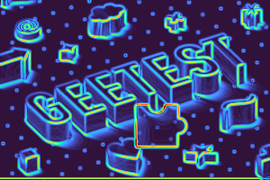
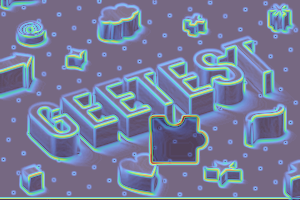
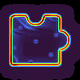
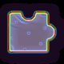

## Geetest Captcha Solver

Инструмент для **поиска X-смещения пазла** в Geetest slider CAPTCHA по двум картинкам (`bg` и `puzzle`);

Ниже подробно описано, **как программа понимает, куда вести ползунок**.

---

## Как это работает

Geetest отдаёт:

- **`bg`**: фон с пазом(место, куда нужно перетащить пазл);
- **`puzzle`**: пазл, который нужно совместить с пазом.

Прямая корреляция по RGB часто “шумная” из‑за фона/цветов/артефактов. Поэтому мы:

1) переводим обе картинки в **карту градиентов** (сильные границы/контуры),
2) делаем **template matching** “пазла” по “фону” уже **по градиентам**,
3) получаем `x` **координату верхнего‑левого угла** лучшего совпадения на `bg`,
4) переводим `x` в **реальную дистанцию перетаскивания** ползунка на странице.

---

## Фото Geetest Slide CAPTCHA

### 1) Исходные картинки `bg` и `puzzle`


### 2) Градиенты (heatmap + overlay)




### 3) Градиенты для пазла (heatmap + overlay)




## Алгоритм определения X (куда вести ползунок)

Ниже описан точный пайплайн, который реализован в `gradient_highlight.py` и используется в `collect_solve_camoufox.py`.

### 1) Карта градиентов

Для `bg` и `puzzle`:

- конвертируем в grayscale;
- (опционально) слегка размываем Gaussian blur (`--blur`), чтобы убрать мелкий шум;
- считаем градиенты одним из методов:
  - **Sobel**: `magnitude = sqrt(Gx^2 + Gy^2)` (где `Gx`/`Gy`  производные по X/Y)
  - **Laplacian**: `magnitude = abs(Laplacian(I))` (вторая производная, берём модуль)
- нормализуем magnitude в `uint8 [0..255]`.

Результат: две “карты интенсивности контуров”: `bg_mag_u8` и `puz_mag_u8`.

### 2) Сопоставление шаблона по градиентам (template matching)
Эта часть может оказаться сложной для понимания, рекомендую обратиться за помощью к ИИ.

- приводим карты к `float32` и масштабу `[0..1]`;
- запускаем `cv2.matchTemplate` с метрикой **`TM_CCORR_NORMED`**;
- если у `puzzle` есть alpha‑канал, используем его как **mask**:
  - учитываем только непрозрачную часть пазла (где alpha > 0),
  - игнорируем прозрачные области, которые иначе портят корреляцию.

На выходе получаем:

- **`max_loc = (x, y)`**  координаты лучшего совпадения (верхний‑левый угол пазла на фоне),
- **`score`**  нормированный скор (чем выше, тем лучше совпадение).

Именно **`x`** затем используется как оценка “сколько нужно сместиться по горизонтали”.

### 3) Перевод X из координат картинки в пиксели страницы

`x` найден в координатах скачанного изображения `bg.png`. Но на странице фон может отображаться с другим размером (CSS scaling).

Поэтому при автодрагинге делаем:

- читаем **реальную ширину** `bg` на странице через DOM (`getBoundingClientRect().width`);
- считаем коэффициент масштаба: `ratio = bg_display_width_px / bg_image_width_px`
- переводим: `drag_distance_px = x * ratio + drag_fudge`

Где `drag_fudge` (`--drag-fudge`)  небольшой постоянный сдвиг для калибровки (если конкретная реализация Geetest требует “плюс/минус N пикселей” из‑за внутренних отступов/геометрии трека).

### 4) Перетаскивание ползунка

Перетаскивание делается внутренней мышью Camoufox:

- движения разбиты на шаги,
- используется **ease‑out** траектория (быстрее в начале, медленнее в конце),
- добавляется микроколебание по Y, чтобы не выглядеть как идеальный робот.

В нашем случае https://www.geetest.com не следит за действиями пользователя вне капчи, поэтому мы можем пренебречь плавными движениями мыши и остальными не менее важными настройками парсинга.

---

## Установка

```bash
py -m venv .venv 
.venv\Scripts\activate
pip install -r requirements.txt
```

---

## Быстрый старт

В репозитории уже есть примеры:

- `data/bg.png`  фон
- `data/puzzle.png`  пазл

### Найти положение пазла на фоне по градиентам

```bash
python .\gradient_highlight.py --input .\data\bg.png --match-puzzle .\data\puzzle.png --out-dir .\data
```

Выход:

- `data/match_location.png` (визуализация)
- в консоль: `score` и координаты `x/y`

---

## Решение капчи на сайте через Camoufox

- открывает страницу через Camoufox
- вызывает капчу
- извлекает `bg`/`puzzle`
- считает `x` через сопоставление по градиентам
- перетаскивает ползунок на рассчитанную дистанцию

Пример:

```bash
python .\collect_solve_camoufox.py --url "https://www.geetest.com/en/demo" --out-dir .\data
```

Полезные флаги:

- `--headless`: запуск без окна
- `--no-drag`: только посчитать `x`, без перетаскивания
- `--drag-fudge N`: калибровка смещения (например `--drag-fudge 2.5`)
- `--method sobel|laplacian`: выбор градиентов
- `--blur K`: размытие (нечётное >=3), `0` выключить

---

## Пакетное тестирование (статистика успеха)

`batch_test_solve_camoufox.py` делает N попыток и выводит процент успеха по “Verification Success” (для Geetest demo).

```bash
python .\batch_test_solve_camoufox.py --n 50 --drag-fudge 0.0 --method sobel --blur 3
```

---

## Параметры CLI (кратко)

### `gradient_highlight.py`

- `--input`: входная картинка (по умолчанию `data/bg.png`)
- `--out-dir`: куда сохранять результаты (по умолчанию `data/`)
- `--method`: `sobel` или `laplacian`
- `--blur`: Gaussian blur (нечётный >=3), `0` чтобы отключить
- `--alpha`: прозрачность overlay (0..1)
- `--show`: показать окна OpenCV
- `--match-puzzle`: путь к пазлу (шаблону)
- `--match-out`: путь для `match_location.png`

### `collect_solve_camoufox.py`

- `--url`: URL страницы (по умолчанию Geetest demo)
- `--out-dir`: сохранить скачанные `bg.png`/`puzzle.png` (опционально)
- `--timeout`: общий таймаут ожидания капчи/картинок
- `--headless`: без окна
- `--drag/--no-drag`: включить/выключить перетаскивание
- `--drag-fudge`: калибровка смещения (px)
- `--post-drag-wait`: пауза после отпускания ползунка
- `--method`, `--blur`: параметры градиентов (как выше)

---

## Структура проекта

- `gradient_highlight.py`  градиенты, визуализация, `find_best_match_on_gradients`
- `collect_solve_camoufox.py`  открытие страницы, сбор картинок, расчёт `x`, автодраг
- `batch_test_solve_camoufox.py`  многократные прогоны и статистика
- `data/`  примеры входных изображений и результаты

